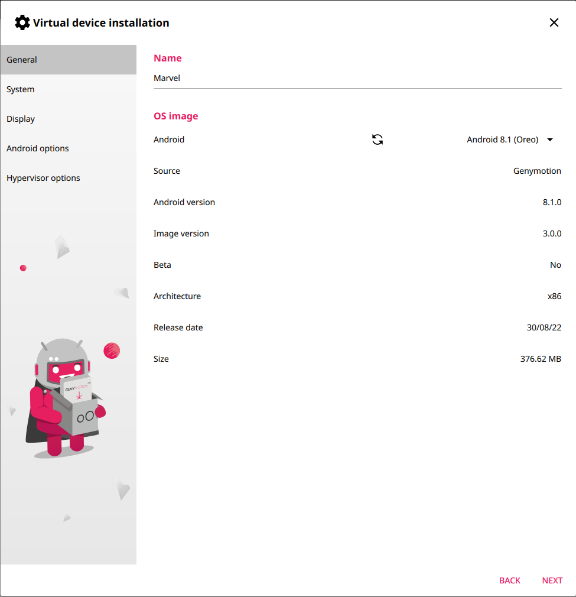

# Defeating MARVEL

## Requirements

This experiment requires a rooted device running Android 8.1 and equipped with Frida. We used an emulated device.

Make sure to have the Java SDK in your PATH to use `jarsigner`.

## Setup

### Emulated Device

To setup an emulated device, first install [Genymotion](https://www.genymotion.com/product-desktop/) and [VirtualBox](https://www.virtualbox.org/).

Once Genymotion is installed, you can create a custom emulated device. You can choose any form factor, but make sure that the Android version is 8.1 (Oreo).



Feel free to adjust the other settings as you prefer, but we suggest keeping the default ones.

Subsequently, please install the corresponding [ARM Translation Package](https://github.com/m9rco/Genymotion_ARM_Translation) to ensure support for apps using ARM native libraries.

### Frida installation

You have to install frida, both locally and on your device.

First, make sure your device is running, then execute the following commands:

```
wget https://github.com/frida/frida/releases/download/16.4.10/frida-server-16.4.10-android-x86.xz
unxz frida-server-16.4.10-android-x86.xz
adb push frida-server-16.4.10-android-x86 /data/local/tmp/frida-server
adb shell chmod 777 /data/local/tmp/frida-server
```

Then, run the frida-server in the background:

```
adb shell /data/local/tmp/frida-server &
```

Make sure to run this everytime the device is rebooted.

Then, install the requirements:

```
pip install -r anti_MARVEL/requirements.txt
```

If the installation has been successful, you should see the list of processes running on the device through the following command: `frida-ps -U`.

### Protecting apps with MARVEL

We already share a local copy of the [MARVEL](https://github.com/totoR13/MARVEL) repository in the current directory and a list of 10 apps to be tested in the `apks` directory. In particular, the `marveloid_output` already contains the protected version of the 10 apps.

If you want to protect an app, you can use our `run_MARVEL.sh` script that, given an app's package name, creates the protected apk and uploads it in the trusted container (for more info, you can check instructions to run MARVEL in a Docker container in the official repository `MARVEL/Docker/README.md`).

The script requires Java (Java 8 is recommended), and it can be executed with the following command, where `br.com.cjdinfo.puzzle` is a directory inside `apks`:

```
./run_MARVEL.sh br.com.cjdinfo.puzzle
```

The generated output in `marveloid_output` is pushed on the device, and the trusted container app executes the app.

## Experiment for Defeating MARVEL

In our scenario, the attacker has access to the apks protected by MARVEL, but is unable to execute them because MARVEL's protections can only be lifted by the trusted container.

Therefore, the attacker can use Frida to run the app in the container and intercept the dynamically loaded code to re-construct the original app.

First, upload the protected apk with the protections and install the trusted container by running the `run_MARVEL.sh` script:

```
./run_MARVEL.sh <package_name>
- <package_name> is one of the directories under the `apks` folder
```

Then, run the script:

```
python anti_MARVEL/frida_intercept.py <apk_path>
- <apk_path> : points to the protected plugin apk.
```

The trusted container is launched and, as soon as it loads a section of the app, the script intercepts it through Frida .

By pressing `CTRL+C` you can trigger the reconstruction of the app with the code retrieved and test it.

Multiple script iterations may be required if more code sections need to be retrieved.

For example, you can run the following command:

```
python anti_MARVEL/frida_intercept.py apks/br.com.cjdinfo.puzzle/marveloid_output/br.com.cjdinfo.puzzle.apk
```

## Expected experiment duration

The experiment is expected to last less than one hour, if executed on the provided apps and the provided pre-built protected versions.

## Expected disk usage

The experiment requires less than 10GB of space, which can only result if an emulator is used and multiple applications are tested.

## Expected output

A new rebuilt app is repackaged, signed, and tested for correctness.
